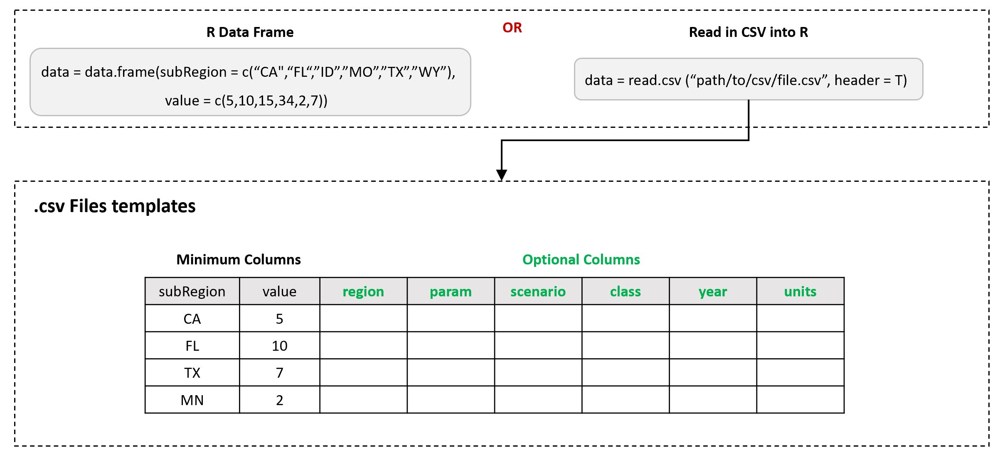

<!-------------------------->
<!-------------------------->
<!-- HTML styles items    -->
<!-------------------------->
<!-------------------------->

<style>
.button {
  background-color: #555555;
  border-radius: 8px;
  border: none;
  color: white;
  padding: 15px 32px;
  text-align: center;
  text-decoration: none;
  display: inline-block;
  font-size: 16px;
  margin: 4px 2px;
  cursor: pointer;
}

.button:hover {
  box-shadow: 0 12px 16px 0 rgba(0,0,0,0.24), 0 17px 50px 0 rgba(0,0,0,0.19);
  background-color: #555555;
  color: gold;
}

</style>

<!-- ------------------------>
<!-- ------------------------>
# Install
<!-- ------------------------>
<!-- ------------------------>
<p align="center"> </p>

1. Download and install:
    - R (https://www.r-project.org/)
    - R studio (https://www.rstudio.com/) (Optional)
    
    
2. In R or R studio:

```r
install.packages("devtools")
devtools::install_github("JGCRI/rchart")
```

Additional steps for UBUNTU from a terminal
```
sudo add-apt-repository ppa:ubuntugis/ppa
sudo apt-get update
sudo apt-get install -y libcurl4-openssl-dev libssl-dev libxml2-dev libudunits2-dev libproj-dev libavfilter-dev  libmagick++-dev
```

Additional steps for MACOSX from a terminal
```
brew install pkg-config
brew install imagemagick@6
```

<!-------------------------->
<!-------------------------->
# Input Formats {#inputs}
<!-------------------------->
<!-------------------------->
<p align="center"> </p>

The main input is the `data` argument in the `chart()` function. This will be an R table which can be created within R or read in from a csv file as shown below.

<p align="center"> </p>

<!-------------------------->
<!-------------------------->
# Output Formats {#outputs}
<!-------------------------->
<!-------------------------->
<p align="center"> </p>

The output of the `chart()` function is a named list with all charts and animations created in the function. The elements of the list can be called individually. Since the output charts are `ggplot` elements all the features of the chart can easily be modified using the taditional `ggplot2` theme options. Examples are provided in the [Themes](#themes) section. 

<!-------------------------->
<!-------------------------->
# Plot Lines Absolute
<!-------------------------->
<!-------------------------->
<p align="center"> </p>

Chart with `params` in each facet and multiple lines for each scenario.

## Single Param
```{r, results = 'hide', eval=TRUE, echo=TRUE, warning=FALSE, error = FALSE, message = FALSE, fig.width=7, fig.height = 5}
library(rchart);
data = data.frame(scenario = c("scen1","scen1","scen1",
                               "scen2","scen2","scen2",
                               "scen3","scen3","scen3"),
                  year = c("2010","2020","2030",
                           "2010","2020","2030",
                           "2010","2020","2030"),
                  param = c(rep("param_1",9)),
                  value = c(32, 38, 54,
                            37, 53, 23,
                            40, 44, 12))

rchart::chart(data)
```

## Multiple Params
```{r, results = 'hide', eval=TRUE, echo=TRUE, warning=FALSE, error = FALSE, message = FALSE}
library(rchart);
data = data.frame(scenario = rep(c("scen1","scen1","scen1",
                               "scen2","scen2","scen2",
                               "scen3","scen3","scen3"),3),
                  year = rep(c("2010","2020","2030",
                           "2010","2020","2030",
                           "2010","2020","2030"),3),
                  param = c(rep("param_1",9),
                            rep("param_2",9),
                            rep("param_3",9)),
                  value = c(c(32, 38, 54,
                              37, 53, 23,
                              40, 44, 12),
                            c(10, 21, 24,
                              67, 83, 93, 
                              10, 34, 02),
                            c(50, 121, 124,
                              367, 483, 593,
                              100, 304, 102)))

rchart::chart(data)
```

## Multiple Params & Regions
```{r, results = 'hide', eval=TRUE, echo=TRUE, warning=FALSE, error = FALSE, message = FALSE, fig.width=21, fig.height = 5}
library(rchart);
data = data.frame(region = rep(c("Spain", "India","Spain", "India","Spain", "India",
                                "Spain", "India","Spain", "India","Spain", "India",
                                "Spain", "India","Spain", "India","Spain", "India"),3),
                  scenario = rep(c("scen1","scen1","scen1","scen1","scen1","scen1",
                               "scen2","scen2","scen2","scen2","scen2","scen2",
                               "scen3","scen3","scen3","scen3","scen3","scen3"),3),
                  year = rep(c("2010","2010","2020","2020","2030","2030",
                           "2010","2010","2020","2020","2030","2030",
                           "2010","2010","2020","2020","2030","2030"),3),
                  param = c(rep("param_1",18),
                            rep("param_2",18),
                            rep("param_3",18)),
                  value = c(c(32, 38, 54, 63, 24, 23,
                              37, 53, 23, 12, 45, 47,
                              40, 44, 12, 30, 99, 103),
                            c(10, 21, 24, 13, 14, 13,
                              67, 83, 93, 92, 95, 107,
                              10, 34, 02, 10, 39, 33),
                            c(50, 121, 124, 113, 214, 313,
                              367, 483, 593, 692, 795, 907,
                              100, 304, 102, 107, 339, 233)))

rchart::chart(data)
```


<!-------------------------->
<!-------------------------->
# Plot Lines Difference
<!-------------------------->
<!-------------------------->
<p align="center"> </p>

Chart with `params` in each facet and multiple lines for each scenario.

## Single Param Diff
```{r, results = 'hide', eval=TRUE, echo=TRUE, warning=FALSE, error = FALSE, message = FALSE, fig.width=14, fig.height = 5}
library(rchart);
data = data.frame(scenario = c("scen1","scen1","scen1",
                               "scen2","scen2","scen2",
                               "scen3","scen3","scen3"),
                  year = c("2010","2020","2030",
                           "2010","2020","2030",
                           "2010","2020","2030"),
                  param = c(rep("param_1",9)),
                  value = c(32, 38, 54,
                            37, 53, 23,
                            40, 44, 12))

my_chart <- rchart::chart(data, scenRef="scen1",show=F) # So that all plots are not shown
my_chart$chart_lines_diff_absolute
my_chart$chart_lines_diff_percent

```

## Multi Param Diff
```{r, results = 'hide', eval=TRUE, echo=TRUE, warning=FALSE, error = FALSE, message = FALSE, fig.width=14, fig.height=15}
library(rchart);
data = data.frame(scenario = rep(c("scen1","scen1","scen1",
                               "scen2","scen2","scen2",
                               "scen3","scen3","scen3"),3),
                  year = rep(c("2010","2020","2030",
                           "2010","2020","2030",
                           "2010","2020","2030"),3),
                  param = c(rep("param_1",9),
                            rep("param_2",9),
                            rep("param_3",9)),
                  value = c(c(32, 38, 54,
                              37, 53, 23,
                              40, 44, 12),
                            c(10, 21, 24,
                              67, 83, 93, 
                              10, 34, 02),
                            c(50, 121, 124,
                              367, 483, 593,
                              100, 304, 102)))

my_chart <- rchart::chart(data, scenRef="scen1",show=F) # So that all plots are not shown
my_chart$chart_lines_diff_absolute
my_chart$chart_lines_diff_percent

```

## Multi Param & Region Diff
```{r, results = 'hide', eval=TRUE, echo=TRUE, warning=FALSE, error = FALSE, message = FALSE, fig.width=14, fig.height=15}
library(rchart);
data = data.frame(region = rep(c("Spain", "India","Spain", "India","Spain", "India",
                                "Spain", "India","Spain", "India","Spain", "India",
                                "Spain", "India","Spain", "India","Spain", "India"),3),
                  scenario = rep(c("scen1","scen1","scen1","scen1","scen1","scen1",
                               "scen2","scen2","scen2","scen2","scen2","scen2",
                               "scen3","scen3","scen3","scen3","scen3","scen3"),3),
                  year = rep(c("2010","2010","2020","2020","2030","2030",
                           "2010","2010","2020","2020","2030","2030",
                           "2010","2010","2020","2020","2030","2030"),3),
                  param = c(rep("param_1",18),
                            rep("param_2",18),
                            rep("param_3",18)),
                  value = c(c(32, 38, 54, 63, 24, 23,
                              37, 53, 23, 12, 45, 47,
                              40, 44, 12, 30, 99, 103),
                            c(10, 21, 24, 13, 14, 13,
                              67, 83, 93, 92, 95, 107,
                              10, 34, 02, 10, 39, 33),
                            c(50, 121, 124, 113, 214, 313,
                              367, 483, 593, 692, 795, 907,
                              100, 304, 102, 107, 339, 233)))

my_chart <- rchart::chart(data, scenRef="scen1",show=F) # So that all plots are not shown
my_chart$chart_lines_diff_absolute
my_chart$chart_lines_diff_percent

```
